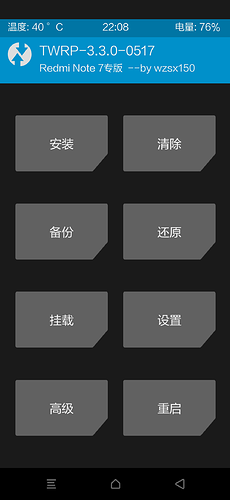
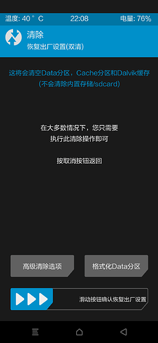
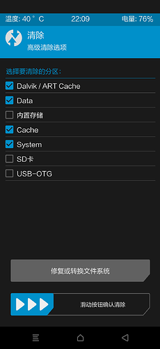
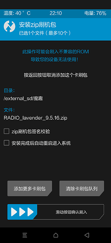
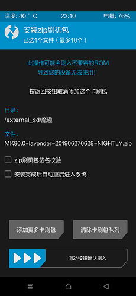
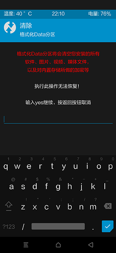

# 红米Note7（lavender）刷机教程
## 1.解锁BL（必须）
在刷机之前必须解锁手机，解锁手机BL参考(https://jingyan.baidu.com/article/08b6a591a0708c14a80922ff.html)
## 2.刷入REC
下载RECOVERY（可通过开发版来获取root,也可以使用安装Magisk获取root）（推荐wzsx150的twrp8）给予镜像助手
[会命令行的同学，还可使用fastboot命令输入：fastboot flash recovery 你的recovery名字.img]
## 3.下载
下载ROM及底包点，其中推荐说那个红米Note7系统包，MIUI10.3.4的包，Magisk使用19.3的包
将下载文件的全部放在便携式存储(SD或U盘)里
## 4.开始刷入
（刷前备好SD卡或U盘以防万一！）
- 重启至REC(音量加+电源键)

- 选择清除

-选择高级清除勾选（Dalvik/ART Cache,Data,Cache,System）并滑动

- 返回主页选择安装，刷入RADIO底包

- 刷入ROM

- 刷入magisk（可选）
- 刷入gapps（可选）
- 最后格式化Data，并重启手机

